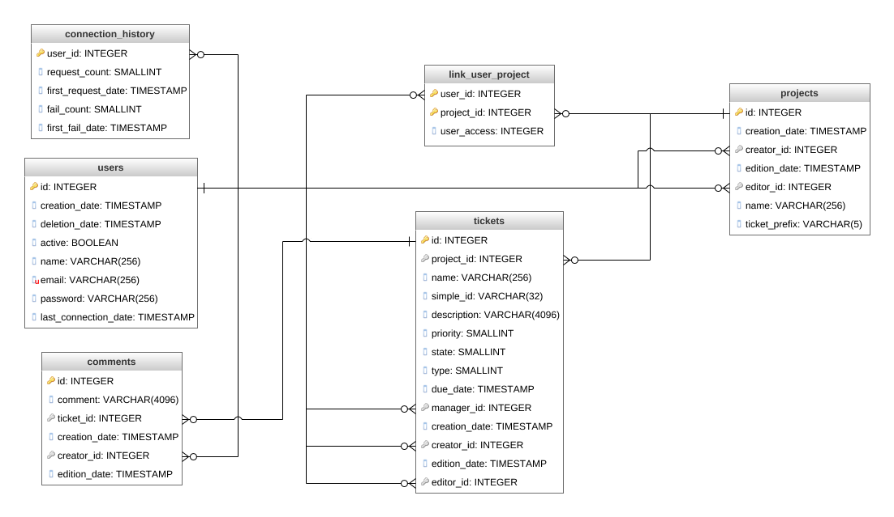

# Ticket'Hack

## Menu

* [API](#api)
* [Data formats](#data-formats)
* [Database Diagram](#database)

## API

API definition can be found at [Swagger](https://app.swaggerhub.com/apis/top8/TicketHack/ "Click to see full API").

## Data formats

### Users informations

| Information | Type | Editable | Name |
| -: | :-: | :-: | - |
| **ID** | ID | No | `id` |
| **Name** | Text | **Yes** | `name` |
| **Email** | Text | **Yes** | `email` |
| **Password** | SHA256 | **Yes** | `password` |
| **Creation date** | Date | No | `creation_date` |
| **Last connection date** | Date | No | `last_connection_date` |

### Projects informations

| Information | Type | Editable | Name |
| -: | :-: | :-: | - |
| **ID** | ID | No | `id` |
| **Name** | Text | **Yes** | `name` |
| **Ticket prefix** | Text | No | `ticket_prefix` |
| **Creation date** | Date | No | `creation_date` |
| **Creator** | ID | No | `creator_id` |
| **Edition date** | Date | No | `edition_date` |
| **Editor** | ID | No | `editor_id` |

### Tickets informations

| Information | Type | Editable | Name |
| -: | :-: | :-: | - |
| **ID** | ID | No | `id` |
| **Name** | Text | **Yes** | `name` |
| **Simple ID** | Text | No | `simple_id` |
| **Description** | Text | **Yes** | `description` |
| **Manager** | ID | **Yes** | `manager_id` |
| **Due date** | Date | **Yes** | `due_date` |
| **Type** | Number | **Yes** | `type` |
| **State** | Number | **Yes** | `state` |
| **Priority** | Number | **Yes** | `priority` |
| **Project** | ID | No | `project_id` |
| **Creation date** | Date | No | `creation_date` |
| **Creator** | ID | No | `creator_id` |
| **Edition date** | Date | No | `edition_date` |
| **Editor** | ID | No | `editor_id` |

| Value | Ticket type |
| -: | -|
| 0 | Bug |
| 1 | Improvement |
| 2 | Verification |

| Value | Ticket state |
| -: | -|
| 0 | Open |
| 1 | Working |
| 2 | Review |
| 3 | Closed |

| Value | Ticket priority |
| -: | -|
| 0 | Lowest |
| 1 | Low |
| 2 | Medium |
| 3 | High |
| 4 | Highest |

### Comments informations

| Information | Type | Editable | Name |
| -: | :-: | :-: | - |
| **ID** | ID | No | `id` |
| **Comment** | Text | **Yes** | `comment` |
| **Creation date** | Date | No | `creation_date` |
| **Creator** | ID | No | `creator_id` |
| **Edition date** | Date | No | `edition_date` |

## Database

